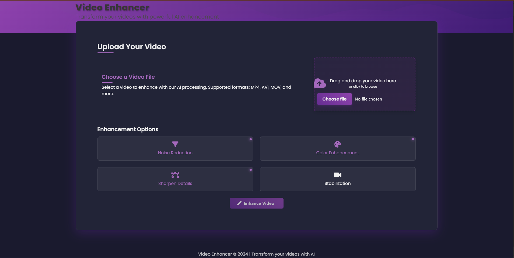
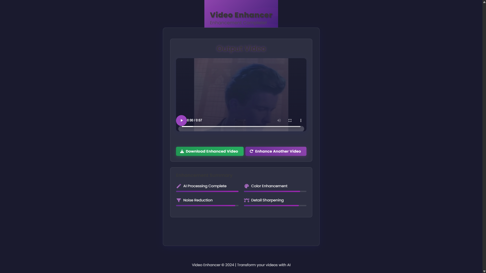

# Video Enhancer

A sleek web application for enhancing videos using AI-powered techniques. The application features a beautiful purple and black theme with modern UI elements, animations, and blur effects.



## 🌟 Features

- **Video Enhancement**: AI-powered enhancement for your videos
  - Noise reduction
  - Color enhancement
  - Detail sharpening
  - Video stabilization (optional)
- **Modern UI**: Beautiful purple and black themed interface with blur effects and animations
- **User-Friendly**: Simple drag-and-drop interface
- **Real-Time Feedback**: Progress tracking during enhancement
- **Responsive Design**: Works on desktop and mobile devices

## 📸 Screenshots

### Home Screen


### File Upload
![File Upload](screenshots/file_upload.png

### Processing Screen
![Processing](screenshots/processing.png

### Result Screen


## 🚀 Getting Started

### Prerequisites

- Python 3.7+
- Flask
- OpenCV
- NumPy
- Scikit-image

### Installation

1. Clone this repository:
   ```bash
   git clone https://github.com/yourusername/video-enhancer.git
   cd video-enhancer
   ```

2. Install required Python packages:
   ```bash
   pip install -r requirements.txt
   ```

3. Run the application:
   ```bash
   python app.py
   ```

4. Open your browser and navigate to:
   ```
   http://127.0.0.1:5000
   ```

## 🛠️ How It Works

1. **Upload a Video**: Drag and drop or select a video file using the upload button
2. **Choose Enhancement Options**: Select the desired enhancement options
3. **Enhance Video**: Click the "Enhance Video" button to start the enhancement process
4. **Processing**: The application will show a progress screen while enhancing your video
5. **Download**: Once processing is complete, you can preview and download the enhanced video

## 🔧 Technical Details

The Video Enhancer application uses a combination of:

- **Frontend**: HTML, CSS, JavaScript, Bulma CSS Framework
- **Backend**: Flask (Python web framework)
- **Video Processing**: OpenCV, NumPy, Scikit-image
- **Enhancement Techniques**:
  - Frame extraction and resizing
  - Noise reduction algorithms
  - Color correction
  - Detail enhancement
  - Frame reconstruction

## 📁 Project Structure

```
video-enhancer/
├── app.py                # Main Flask application
├── Enhancer.py           # Core enhancement logic
├── preprocess.py         # Video preprocessing functions
├── denoise.py            # Noise reduction algorithms
├── requirements.txt      # Python dependencies
├── static/               # Static assets
│   ├── style.css         # Main CSS
│   ├── vdo_style.css     # Video player CSS
│   ├── script.js         # JavaScript
│   └── output_video.mp4  # Output video (generated)
├── templates/            # HTML templates
│   ├── index.html        # Home page
│   ├── wait.html         # Processing page
│   └── video.html        # Results page
├── media/                # Media processing directories
│   ├── temp/
│   ├── resized_temp/
│   ├── target_output_temp/
│   ├── denoised_frames_temp/
│   └── output/
└── upload/               # Upload directory
```

## ⚙️ Configuration

You can modify the enhancement parameters in the `Enhancer.py` file:

- Change output resolution (default: 1280x720)
- Adjust noise reduction parameters
- Modify enhancement intensity

## 🤝 Contributing

Contributions are welcome! Please feel free to submit a Pull Request.

## 📄 License

This project is licensed under the MIT License - see the LICENSE file for details.

## 🙏 Acknowledgements

- [Flask](https://flask.palletsprojects.com/) - Web framework
- [Bulma](https://bulma.io/) - CSS framework
- [Font Awesome](https://fontawesome.com/) - Icons
- [OpenCV](https://opencv.org/) - Computer vision library 